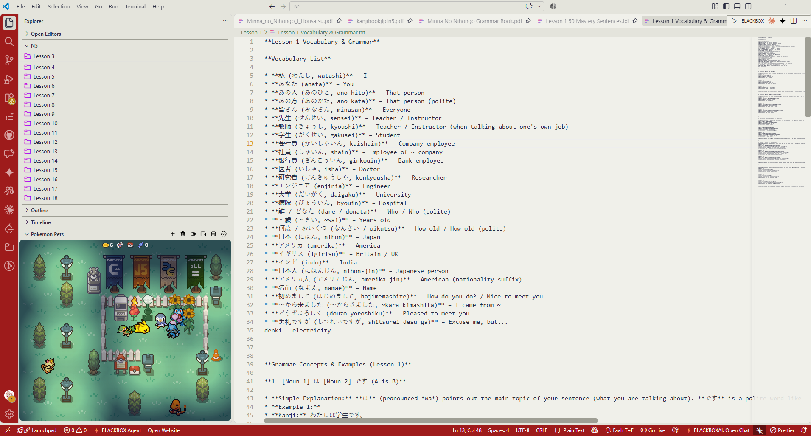

<!-- TITLE with Animated Typing Effect -->

  

<h1 align="center">🔴 Game Boy Pokémon Light Theme 🟡</h1>
<h3 align="center">Transform your editor into a retro-engineered Silph Co. Pokédex.</h3>

 
 

<!-- Screenshot Placeholder -->

  
   
 

  
  

 
  <strong>Note:</strong> The Pokémon pet widget shown in the screenshot is a separate third-party extension available on the VS Code Marketplace and is not included with this theme. This repository provides the color theme only.

 

---

## 🚀 What is This Theme?

The **Game Boy Pokémon Light Theme** is a minimalist, retro-tech VS Code extension inspired by classic Nintendo handhelds and the iconic Pokédex. 

Instead of overwhelming your eyes with neon colors, this theme relies on an ergonomic, high-contrast light palette. It frames your code in a Deep Crimson "L-Chassis" Activity Bar and Status Bar, paired with a Matte Gray editor canvas and Pikachu Gold accents for active selections. 

 

---

 

## ⚙️ How to Install & Apply

Since this theme is hosted directly on GitHub, you can easily install it using the packaged `.vsix` file.

### Step 1: Download
1. Go to the main folder of this repository.
2. Download the `gameboy-pokemon-theme-1.0.0.vsix` file to your computer.

### Step 2: Install in VS Code
1. Open Visual Studio Code.
2. Navigate to the **Extensions** view by clicking the square icon on the left sidebar (or pressing `Ctrl+Shift+X`).
3. Click the `...` (Views and More Actions) icon at the top right of the Extensions panel.
4. Select **Install from VSIX...** from the dropdown menu.
5. Locate the downloaded `.vsix` file and click **Install**.

### Step 3: Apply the Theme
1. Open the Command Palette in VS Code (`Ctrl+Shift+P` or `Cmd+Shift+P` on Mac).
2. Type `Preferences: Color Theme` and hit Enter.
3. Select **Game Boy Pokémon Light** from the list.

 

---

 

## 🎨 Color Palette & Specs

 

<table>
  <thead>
    <tr>
      <th>Color Element</th>
      <th>Hex Code</th>
      <th>Purpose / UI Application</th>
    </tr>
  </thead>
  <tbody>
    <tr>
      <td>🔴 <strong>Deep Crimson</strong></td>
      <td><code>#9E1B1B</code></td>
      <td>Pokédex L-Chassis (Activity Bar, Status Bar, Active Tab borders)</td>
    </tr>
    <tr>
      <td>🟡 <strong>Pikachu Gold</strong></td>
      <td><code>#D99B26</code></td>
      <td>Notification badges, active line numbers, and cursor</td>
    </tr>
    <tr>
      <td>⚪ <strong>Shell Gray</strong></td>
      <td><code>#F0F0EA</code></td>
      <td>Main Editor Canvas (Background)</td>
    </tr>
    <tr>
      <td>🔘 <strong>Matte Gray</strong></td>
      <td><code>#E4E4DC</code></td>
      <td>Sidebar and inactive tabs background</td>
    </tr>
    <tr>
      <td>🕹️ <strong>D-Pad Gray</strong></td>
      <td><code>#9E9E94</code></td>
      <td>1px solid borders dividing UI panels</td>
    </tr>
    <tr>
      <td>🌑 <strong>Charcoal Black</strong></td>
      <td><code>#2B2D42</code></td>
      <td>Primary text and sidebar typography</td>
    </tr>
  </tbody>
</table>

 

---

 

## 👨‍💻 About the Creator

**Sumedh Pimplikar** – Software Engineer, Developer, & Builder  

*Portfolio – [sumedhpimplikar.vercel.app](https://sumedhpimplikar.vercel.app/)*
